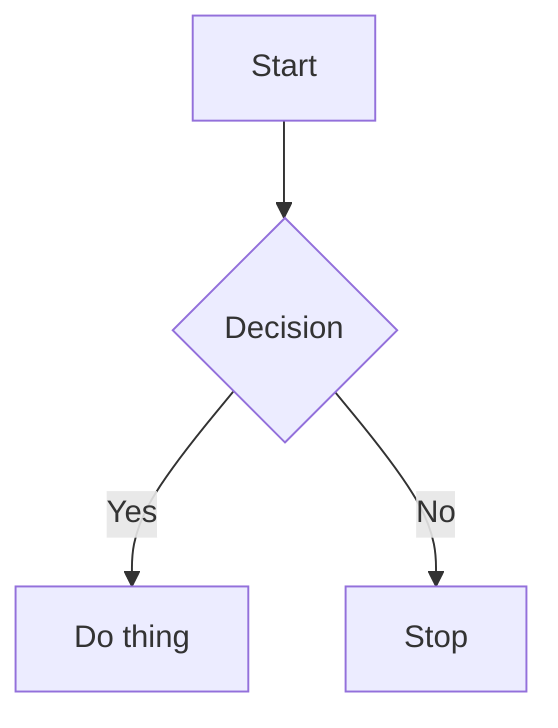

Setext H1
=========

Intro paragraph with **bold**, *italic*, _alt italic_, ~~strikethrough~~, `inline code`, and a [link](https://example.com).

This line ends with two spaces then newline.  
So the next line is a hard break via two-space rule.

This line ends with a backslash then newline.\
So the next line is a hard break via backslash rule.

This is a soft
break — just a newline between words.

Setext H2
---------

Another paragraph with an autolink <https://example.org>, a bare URL https://bare-url.example.com (GFM autolink), an email autolink <test@example.com>, and an image .

# ATX Heading 1

## ATX Heading 2

### ATX Heading 3

#### ATX Heading 4

##### ATX Heading 5

###### ATX Heading 6

####### Not a heading (7+ hashes is invalid)

## Lists

Unordered list (tight):

- Item one
- Item two
  - Nested item
  - Another nested
    - Triple nested
- Item three

Unordered list (loose — blank lines between items):

- First loose item

- Second loose item

- Third loose item

Ordered list:

1. First
2. Second
3. Third

Ordered list starting at 5:

5. Five
6. Six
7. Seven

Mixed nested list:

1. Top ordered
   - Nested unordered
     1. Deep ordered
     2. Another deep
2. Second top

List item with multiple paragraphs:

- First paragraph of item.

  Second paragraph of the same item.

  Third paragraph, still the same item.

- Next item.

Task list:

- [ ] Unchecked task
- [x] Checked task
- [X] Checked with capital X
- [ ] Another unchecked
  - [x] Nested checked
  - [ ] Nested unchecked

## Tables

Simple table:

| Name  | Type    | Default |
|-------|---------|---------|
| foo   | string  | "bar"   |
| count | int     | 0       |
| debug | bool    | false   |

Aligned table:

| Left | Center | Right |
|:-----|:------:|------:|
| a    | b      | c     |
| aa   | bb     | cc    |

Table with inline content:

| Field | Description                     | Example                  |
|-------|---------------------------------|--------------------------|
| `id`  | The **unique** identifier        | `abc-123`                |
| `url` | A [link](https://example.com)   |         |
| `esc` | Pipe \| escaped inside a cell   | literal \| character     |

Table with missing trailing cells:

| A | B | C |
|---|---|---|
| 1 | 2 |
| 3 |
|   |   | z |

## Code Blocks

Fenced Go:

```go
package main

import "fmt"

func main() {
    fmt.Println("hello")
}
```

Fenced Python:

```python
def hello():
    print("world")
```

Fenced bash:

```bash
docmap kitchen_sink.md
```

Fenced with no language:

```
plain fenced code
no language tag
```

Fenced with tildes:

~~~javascript
const x = "tilde fence";
console.log(x);
~~~

Fenced with info string and attributes:

```rust {.highlight #my-code linenos=true}
fn main() {
    println!("rust with attributes");
}
```

Mermaid diagram (just a code block with a known language):



Indented code block:

    plain indented
    code block
    four spaces per line

## Blockquotes

> A normal blockquote.
> Second line of the same quote.

> Blockquote with **inline formatting** and a [link](https://example.com).

> Nested blockquote:
> > Inner quote
> > More inner
> > > Triple nested

> Lazy continuation:
line without a marker
still part of the quote.

## GFM Alerts

> [!NOTE]
> Useful information users should know.

> [!TIP]
> Helpful advice.

> [!IMPORTANT]
> Key information users need to know.

> [!WARNING]
> Urgent info that needs immediate attention.

> [!CAUTION]
> Risks or negative outcomes.

## Thematic Breaks

Three hyphens:

---

Three asterisks:

***

Three underscores:

___

With spaces:

- - -

## Links and References

Inline link: [Google](https://google.com).

Inline link with title: [Google](https://google.com "Search engine").

Reference link: [ref link][my-ref].

Collapsed reference: [my-ref][].

Shortcut reference: [my-ref].

Image reference: ![alt][img-ref].

Image reference with title: ![alt][img-ref-titled].

[my-ref]: https://example.com "Optional title"
[img-ref]: image.png
[img-ref-titled]: image.png "Image title"

## Footnotes

Here's a sentence with a footnote[^1]. And another[^bignote]. And a third[^named-ref].

[^1]: The first footnote.
[^bignote]: Here's one with multiple lines.

    Indented paragraphs are part of it.

    And a third paragraph in the same footnote.

[^named-ref]: Named footnotes work too.

## Definition Lists (Pandoc)

Term 1
: Definition of term 1.

Term 2
: First definition.
: Second definition.

Term with *inline* formatting
: Definition can also have **formatting** and [links](https://example.com).

## Math

Inline math: $E = mc^2$ is famous. Also $a^2 + b^2 = c^2$.

Block math (dollar fence):

$$
\int_0^\infty e^{-x^2} dx = \frac{\sqrt{\pi}}{2}
$$

Block math (bracket fence):

\[
\sum_{i=1}^{n} i = \frac{n(n+1)}{2}
\]

## HTML Blocks

<div class="note">
  <p>Raw HTML inside markdown.</p>
</div>

<details>
<summary>Click to expand</summary>

Hidden content revealed when expanded. Can contain **markdown** too.

- list inside details
- more items

</details>

<kbd>Ctrl</kbd>+<kbd>C</kbd> to copy, <kbd>Ctrl</kbd>+<kbd>V</kbd> to paste.

<!-- This is an HTML comment -->

<!--
Multi-line
HTML comment
-->

HTML entities: &copy; 2026, &amp; ampersand, &lt;tag&gt;, &#169; numeric, &#x2665; hex.

## GFM Extras

Mentions: @octocat, @jordancoin.

Issue references: #123, GH-456, user/repo#789.

Commit SHA autolink: 6dcb09b5b57875f334f61aebed695e2e4193db5e.

Emoji shortcodes: :smile: :rocket: :+1: :heart:.

## Obsidian Wiki Links

Basic wiki link: [[Some Page]].

Wiki link with alias: [[Some Page|display text]].

Wiki link to header: [[Some Page#Header Name]].

Wiki link to block: [[Some Page#^block-id]].

Embed image: ![[image.png]].

Embed image with size: ![[image.png|200]].

Embed image with dimensions: ![[image.png|200x100]].

Embed a page: ![[Some Page]].

Embed a specific section: ![[Some Page#Section]].

Embed a block: ![[Some Page#^block-id]].

## Cross-file References

See [CONTRIBUTING](CONTRIBUTING.md) and [the readme](README.md#install) and [architecture](docs/ARCHITECTURE.md).

## Emphasis Edge Cases

***bold italic***, **_bold italic alt_**, ~~strike **bold inside strike**~~.

Intra-word: un**believable**-ly good.

Nested: **bold with *italic inside* it**.

Code inside emphasis: *italic with `code` inside*.

## Escape Sequences

\*not italic\*, \`not code\`, \# not a heading, \[not a link\], \\ backslash, \> not a quote.

## Heading With Inline Code `function()`

## Heading With **Bold** and *Italic*

## Heading With [Link](https://example.com)

## Empty Heading Content

##

## Final Paragraph

End of fixture.
